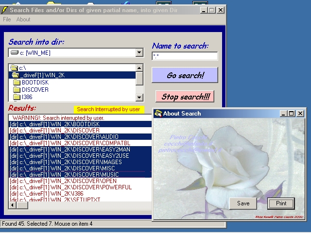



## Search in drives

### Description

The program performs searches of files

and dirs into a given directory, that

partially match a given name (also

wildcars accepted)

May be you can learn a lot, reading with attention the code, because

the many solution taken writing the code, to force some controls to a

more handy behaviour.

I list just a few of them:

-the pause sub, takes care also of midnight crossing

-the single click dir selection, that usually requires a double click

-the search engine itself, based on a couple of routines that are

interruptible by the user (button 'Stop search')

-the search itself, that is done either for dirs either for files,

basing on partial macthing of a given name (but also wildcards

are allowed)

-the popup menu (click right) on the results list box, that allows

you to copy up to 3000 lines in the clipboard (to transfer text

to Word to store the results or print a list of them)

-the help-online, at the botton of the form, that will assist you while

you just move over controls (is based on a single routine, named

'help', that is, I presume, well conceived)

-the about form that is able to resize the contained image (a white rose),

to save (button save) the full size image to 'c:\Search About.bmp' or

print the image, in the actual size (larger or smaller as you sized the

about form), using the default printer. The code is very interesting

for the ones interested in printing, zooming and saving images.

-the horizontal scroll bar added in the results

list box

For me there is the pleasure of sharing my way of programming with you.

Have fun!

Program Name: Search

Author: Pietro Cecchi, email: pietrocecchi@inwind.it

Upload to www.planet-source-code.com/vb : 19 november 2000

This program has been written in VB6.
 
### More Info
 
N.A.

             |
---                |---
**Submitted On**   |2000-11-19 00:04:48
**By**             |[pietro ing\. cecchi](https://github.com/Planet-Source-Code/PSCIndex/blob/master/ByAuthor/pietro-ing-cecchi.md)
**Level**          |Intermediate
**User Rating**    |4.0 (8 globes from 2 users)
**Compatibility**  |VB 6\.0
**Category**       |[Complete Applications](https://github.com/Planet-Source-Code/PSCIndex/blob/master/ByCategory/complete-applications__1-27.md)
**World**          |[Visual Basic](https://github.com/Planet-Source-Code/PSCIndex/blob/master/ByWorld/visual-basic.md)
**Archive File**   |[CODE\_UPLOAD1181911182000\.zip](https://github.com/Planet-Source-Code/pietro-ing-cecchi-search-in-drives__1-12925/archive/master.zip)

